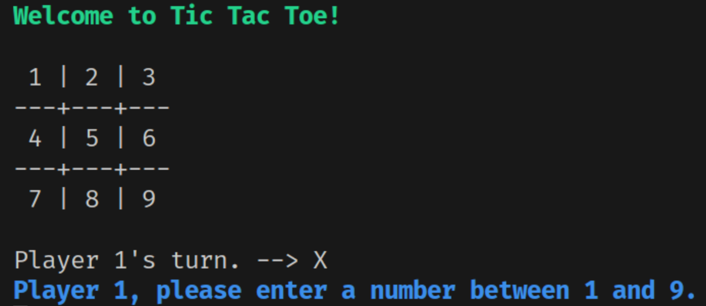

# Tic Tac Toe

This is a Tic Tac Toe game built in Ruby, run in the terminal. It is a [project](https://www.theodinproject.com/lessons/ruby-tic-tac-toe) from the Ruby course of the Odin Project.

## How to play

1. Clone this repository
1. Run `bundle install` in the terminal
1. Run `ruby tic_tac_toe/main.rb` in the terminal
1. Follow the instructions

## Screenshot

